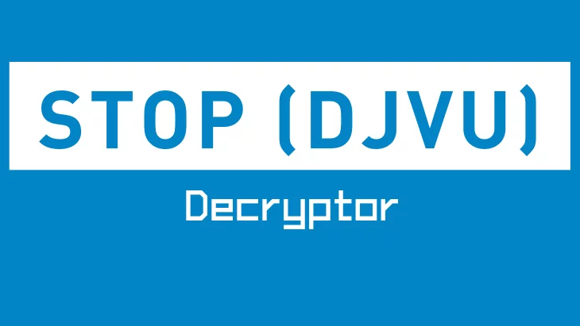

# [**Cứu hộ DRC**](https://www.facebook.com/giaimaransomware)

Chuyên cứu dữ liệu chuyên nghiệp, giải mã virus mã hóa

[Thông tin tổ chức](https://tinnhiemmang.vn/danh-ba-tin-nhiem/cuu-ho-drc-1628756204)

<details>
<summary>Stop/Djvu Ransomware</summary>



* STOP / DJVU Ransomware mã hóa các files của nạn nhân bằng Salsa20 và gắn tên sau đuôi files ví dụ: “.wrui”, “.pcqq”, “.ytbn”, “.nusm”, “.ehiz“, v.v.

* Ghi chú đòi tiền chuộc "_readme.txt" chứa văn bản sau:

```markdown
ATTENTION!

Don't worry my friend, you can return all your files!
All your files like photos, databases, documents and other important are encrypted with strongest encryption and unique key.
The only method of recovering files is to purchase decrypt tool and unique key for you.
This software will decrypt all your encrypted files.
What guarantees you have?
You can send one of your encrypted file from your PC and we decrypt it for free.
But we can decrypt only 1 file for free. File must not contain valuable information.
You can get and look video overview decrypt tool:

Price of private key and decrypt software is $980.
Discount 50% available if you contact us first 72 hours, that's price for you is $490.
Please note that you'll never restore your data without payment.
Check your e-mail "Spam" or "Junk" folder if you don't get answer more than 6 hours.

To get this software you need write on our e-mail:


Reserve e-mail address to contact us:


Support Telegram account:


Your personal ID:

```


**Ghi chú!** | **Cảnh báo!**
------------ | ------------
Trước hết, bạn cần ngắt nguồn máy tính của mình, nếu không nó sẽ tiếp tục mã hóa dữ liệu của bạn nhiều lần và lây nhiễm sang các máy tính trong cùng mạng nội bộ. Trong trường hợp hệ thống của bạn bị nhiễm bằng Windows Remote Desktop ( RDP ), chúng tôi cũng đặc biệt khuyên bạn nên thay đổi tất cả mật khẩu của tất cả người dùng hiện có được phép đăng nhập từ xa và kiểm tra tài khoản người dùng cục bộ xem có các tài khoản phụ khác không mà các Hacker có thể tạo ra. Đối với máy tính cá nhân phải đổi lại hết mật khẩu cá nhân.| Ứng dụng này cần được kết nối với web khi đang hoạt động để nhận hướng dẫn giải mã từ máy chủ.

# **Cập nhật ngày 19 tháng 8 năm 2021**
- .hoop

Có một số hạn chế nhất định liên quan đến những file có thể được khôi phục. Nói về tất cả các phiên bản của STOP Djvu, bạn có thể giải mã được nếu chúng được giải mã thông qua một Public key có sẵn với tool Emsisoft Decryptor. Đối với các loại Djvu cũ, các file cũng có thể được giải mã bằng cách sử dụng các cặp file gốc / mã hóa được upload lên trang [STOP Djvu Submission](https://decrypter.emsisoft.com/submit/stopdjvu/). Hãy nhớ rằng điều này không áp dụng cho Djvu mới được phát triển sau tháng 8 năm 2019.

# **File mẫu là gì**?

Đây là cặp file giống hệt nhau (vì chúng là cùng một dữ liệu chính xác), ngoại trừ một file trùng lặp, được mã hóa và file còn lại thì không. Trang [STOP Djvu Submission](https://decrypter.emsisoft.com/submit/stopdjvu/) có thể phân tích sự khác biệt giữa file được mã hóa và bản sao gốc của cùng một file, cho phép nó xác định cách giải mã file đó. Đối với hầu hết các nạn nhân có biến thể cũ hơn của STOP / Djvu, gửi các cặp file sẽ là cách duy nhất để lấy lại file của bạn.

- Giả mã file bằng cách nào?

- Lựa chọn giải mã

# **Giải mã file bằng cách nào**

</details>

# **Liên hệ**

[Facebook](https://www.facebook.com/giaimaransomware)

